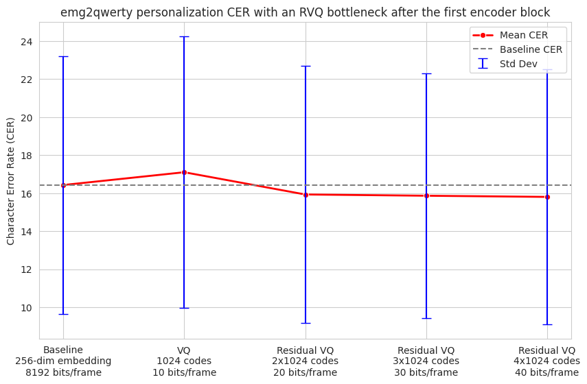
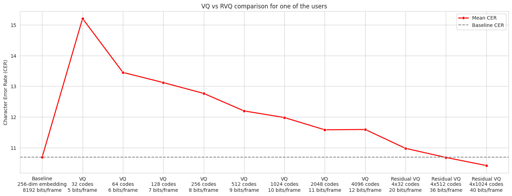

# emg-tokenizer

**Blog post: <https://viswanathgs.github.io/blog/emg-tokenizer/>**

A fork of [facebookresearch/emg2qwerty](https://github.com/facebookresearch/emg2qwerty) that incorporates an end-to-end trainable Residual Vector Quantizer (RVQ) for tokenizing/compressing surface electromyographic (sEMG) signals. Key additions are implemented in [vector_quantizer.py](emg2qwerty/vector_quantizer.py).

RVQ was popularized by [SoundStream: An End-to-End Neural Audio Codec](https://arxiv.org/abs/2107.03312), Zeghidour et al. (2021) in the context of speech/audio, and has emerged as a prominent method to discretize continuous latent representations into tokens for multimodal LLM training. This enables EMG signals to be represented in a form compatible with token-based models, opening the door to leveraging LLM architectures for neural interface and biosignal applications.

`emg-tokenizer` demonstrates that EMG signals can be tokenized with very high compression rates via an RVQ bottleneck without hurting task performance. On the [emg2qwerty personalization benchmark](https://arxiv.org/abs/2410.20081), we can achieve **400x compression** by mapping 256-dimensional continuous float32 embeddings after the first encoder block to 20-bit discrete tokens using a 2-level Residual Vector Quantizer consisting of 1024 codes per level, without degrading task performance measured by Character Error Rate (CER).


**Fig 1:** *RVQ with 2x1024 codes indicates 2 codebook levels consisting of 1024 entries each (10 bits per level), compressing 256-dim float32 embeddings into 20-bit discrete tokens (400x compression). RVQ 2x1024 approximates the expressive capacity of vanilla VQ with 2^20 (≈1 million) codebook entries, while only storing a total of 2048 codes.*


**Fig 2:** *4-level RVQ with 512 codes per level (2048 total codes) fully recovers baseline CER, compressing 256-dim float32 embeddings into 36-bit discrete tokens. In contrast, vanilla VQ with 4096 codes (2x more storage) fails to match baseline performance. This RVQ configuration approximates the expressive capacity of a vanilla VQ with 2^36 (≈68 billion) codebook entries, while only storing 2048 codes.*

Plots were generated using [this Colab notebook](https://colab.research.google.com/drive/1Q9VelBTyahGMDYFEY2FtkMMKYgwvquRi?usp=sharing).

## Training

Follow the [setup instructions](https://github.com/facebookresearch/emg2qwerty#setup) from the original emg2qwerty repository.

Baseline (without VQ) training of personalized models:

```bash
python -m emg2qwerty.train \
  user="glob(user*)" \
  trainer.accelerator=gpu trainer.devices=1 \
  --multirun
```

Residual VQ with 2 codebook levels of 1024 entries each (20 bits per timestep):

```bash
python -m emg2qwerty.train \
  user="glob(user*)" \
  trainer.accelerator=gpu trainer.devices=1 \
  vector_quantizer=residual_vq \
  vector_quantizer.n_vq=2 \
  vector_quantizer.codebook_size=1024 \
  --multirun
```

Full list of RVQ hyperparams at [residual_vq.yaml](config/vector_quantizer/residual_vq.yaml).
